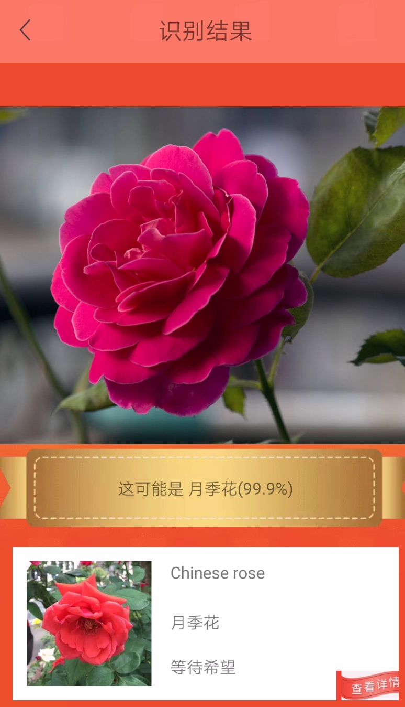
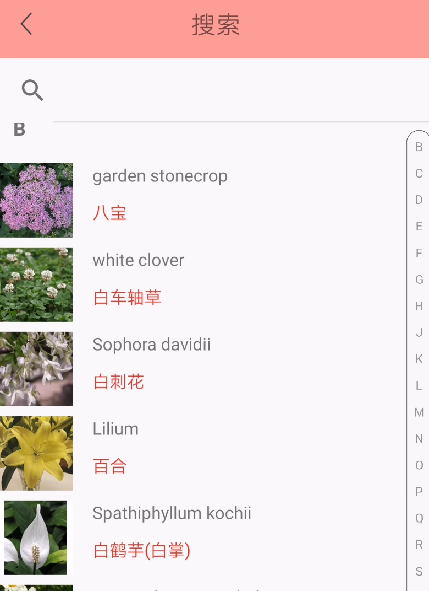
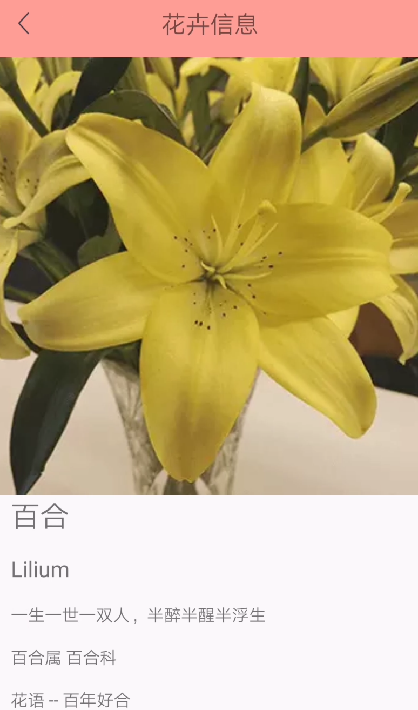

# M$识花 android版 (非官方)

> "微软识花是微软亚洲研究院推出的一款可以识别花朵的 app。
你可以通过实时拍照，或者添加已有的手机图片，它会通过丰富的花卉数据库里查找，而且准确率也是出奇的高。
>
> 它会显示是什么花卉，还有花卉的详细介绍，分类以及它的药用价值等等。
>
> 目前只有iOS 版本。"

这可能是一个PR项目，一直没有android版本。

最近换android手机，正好用kotlin实现一下。

## 下载地址

apk下载地址

链接: https://pan.baidu.com/s/1AFDbO6mhPAQpqC0y_6i92A 提取码: 4rk7

## 实现
微软识花的识别过程完成是离线的，所有数据都在app内。
 
识别分成2部分，先识别是否是花，然后再识别具体的花的种类，都是用googlenet网络训练的。
 
classifier_googlenet_25M.caffemodel 这个模型能识别110个大类，包括花，城市，键盘之类的。 
 
作为一个识别软件，键盘的识别其实很重要，因为用户拿着app不自觉就拍个键盘给你。
 
识别到是花之后，会调用第二个模型plant_googlenet_25M.caffemodel。这个模型包含了403种花。
 
花的具体信息保存在一个sqlite数据库中FlowerInfo.db。同时403种花的图片也都在app里面，这要是为什么iOS版App有130多M。
 
android版本为了减少大小，把图片都转成了webp。最后apk大约60M。
 
这个App最重要的功能是识别，所以还是要靠caffe-android-lib还实现caffemodel的使用。
 
也尝试过一些其他的库（比如MNN的caffemodel converter），只有caffe-android-lib调用成功了。
 
不过为了让caffe-android-lib调用，prototxt的Input层格式需要稍微改一下。 

### 截图

## 依赖

https://github.com/sh1r0/caffe-android-lib

